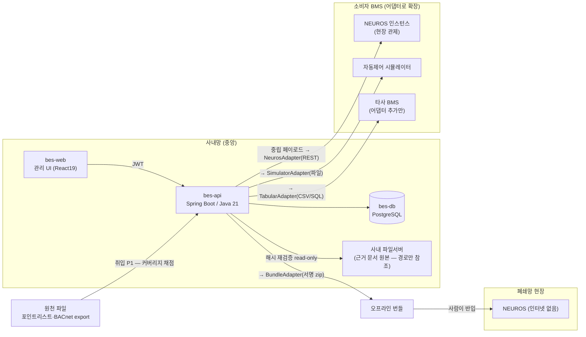
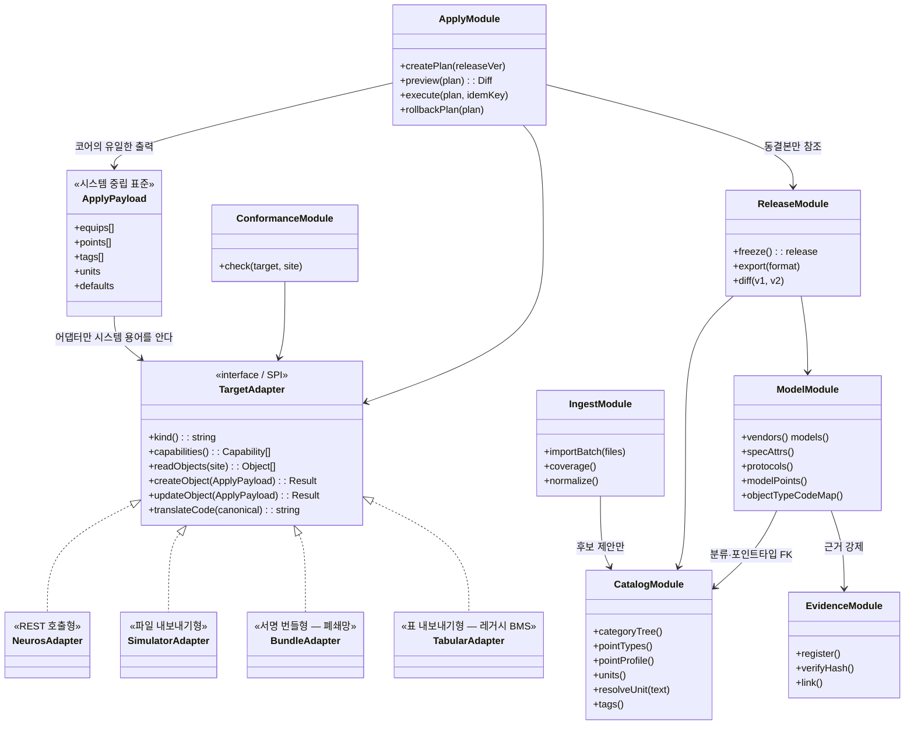
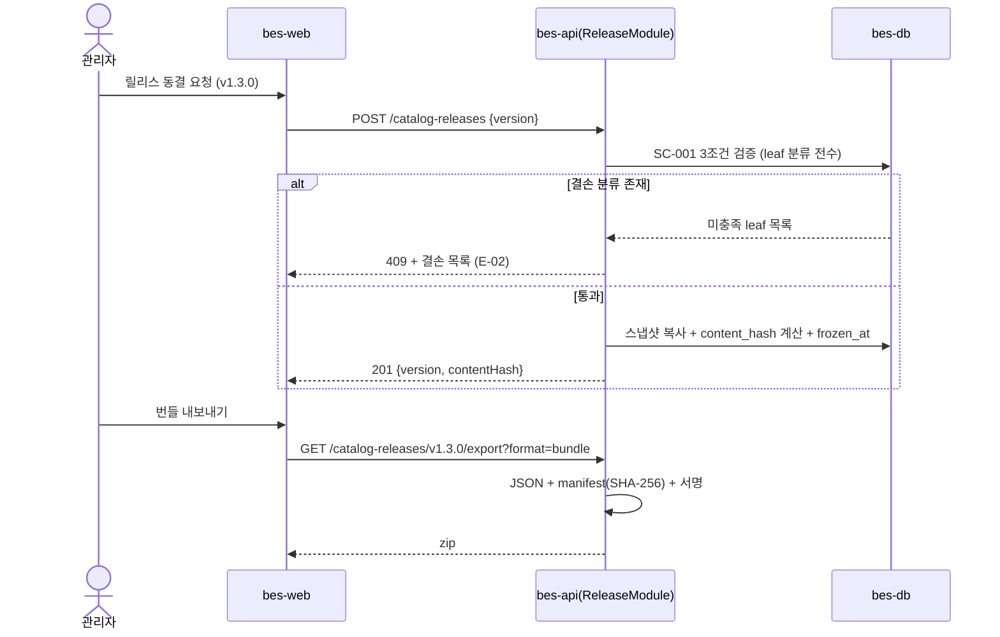
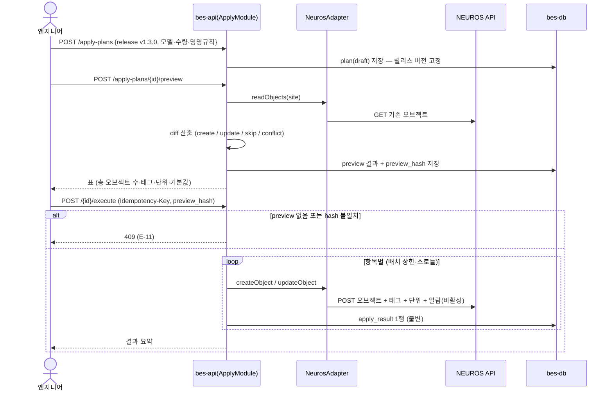
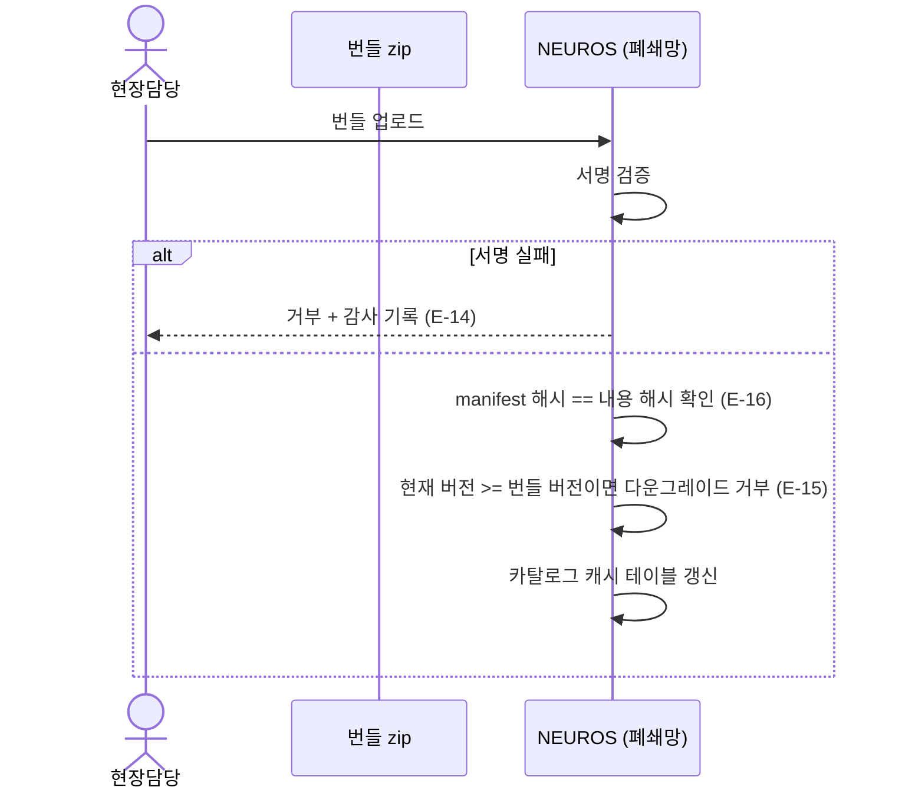
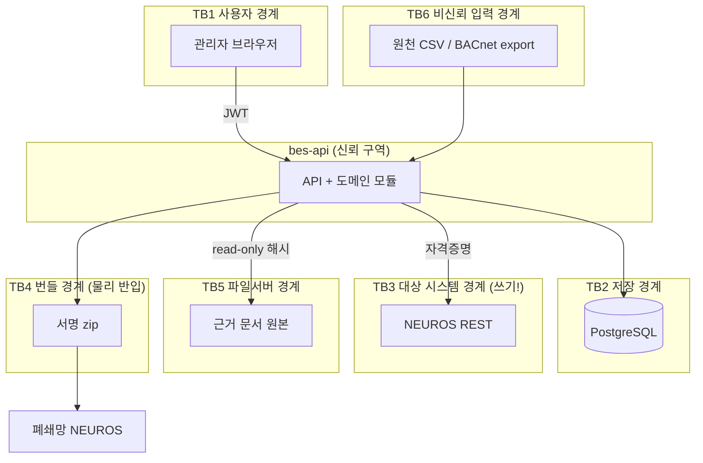

# 아키텍처 — BMS 장비 스펙 기준 DB

- 작성 2026-07-27 · service-autopilot A4 · 선행 `05-prd.md`

## Context & Scope

기준 DB는 **설계 시점(design-time) 도구**다. 실시간 값 경로에 놓이지 않고, BMS에 **투입**만 한다.

- 소비자: **어떤 BMS든**. 현재 확인된 대상은 **NEUROS(SiWeb)** 관제 인스턴스(현장별, 폐쇄망 다수) ·
  **자동제어 시뮬레이터**(사내)이고, 타사 BMS는 **어댑터 추가만으로** 지원한다(사용자 확정 요구, 2026-07-27).
  → 그래서 코어는 NEUROS를 모른다. NEUROS는 어댑터 한 개일 뿐이다.
- 기존 제약: NEUROS는 Java 21 / Spring Boot / MyBatis(XML) / React 19+Vite / MSSQL·PostgreSQL 양쪽 지원 /
  단일 JAR 배포 / JWT `issuer=neuros` / 권한 `<모듈>:<자원>:<행위>` (프로젝트 `CLAUDE.md`)
- 우리 선택: **같은 스택**을 쓴다(팀 역량·어댑터 비용 0). 단 **DB는 PostgreSQL 단일**(A-06) — 기준 DB는
  현장 배포물이 아니라 사내 중앙 1인스턴스이므로 이중 DDL 부담을 지지 않는다.

## Goals / Non-goals

- Goals: G1 표준 정의 · G2 적용 · G3 다중 소비자 동일 버전 (`05-prd.md`)
- Non-goals: 실시간 수집, 제어 실행, 조달/재고, BIM, 유료 표준 원문, NEUROS DB 직접 쓰기

## 설계

### 시스템 컨텍스트

### 구현 접근 — 난점과 대응

| 난점 | 왜 어려운가 | 대응 |
|---|---|---|
| **N-1 표준과 현장의 오염 차단** | 현장 이름 규칙이 원천마다 다르고(실측 O-12) 한 번 섞이면 표준을 되돌릴 수 없다 | 카탈로그(`bes_*` 표준·모델) 계층과 취입(`bes_import_*`·`bes_raw_point`) 계층을 **물리적으로 분리**. 취입 데이터는 카탈로그에 자동 반영되지 않고 **후보 제안**까지만 |
| **N-2 스펙 근거 추적** | 스펙이 틀리면 현장 장비에 잘못된 값이 적용된다 | 모든 스펙 행에 `evidence_seq` 또는 `unverified` 강제(FR-021). 근거는 경로+SHA-256 메타만(Q3) |
| **N-3 적용의 되돌릴 수 없음** | 대량 오브젝트 생성은 현장 관제 화면을 오염시킨다 | **preview → 승인 → execute** 2단계(A-08) + `Idempotency-Key` + 항목별 결과 기록 + 롤백 계획 생성(FR-045) |
| **N-4 코드 체계 불일치** | BACnet enum(MSI=13/MSO=14/MSV=19)과 NEUROS 코드(6/7/8)가 6번부터 어긋난다(실측 O-05) | 단일 canonical 코드 + 체계별 매핑 테이블(`bes_object_type_code`). 왕복 무손실을 SC-008로 강제 |
| **N-5 폐쇄망 배포** | 현장이 중앙 API를 호출할 수 없다 | 릴리스를 **서명된 zip 번들**로 내보내고 NEUROS가 import. 중앙 의존 0 |
| **N-6 버전 재현성** | Haystack·Brick 온톨로지가 버전마다 바뀐다 | 릴리스에 표준명+버전을 고정 기록하고 동결 해시로 봉인(FR-030) |
| **N-7 스펙 속성의 가변성** | 장비군마다 정격 속성이 완전히 다르다 | 속성을 **정규화 테이블**(`bes_spec_attr_def` + `bes_model_spec_attr`)로. JSONB 단문서는 검증·질의가 안 됨 → `spec_extra` JSONB는 보조로만 |
| **N-8 시스템 중립성 (확장성)** | BMS마다 오브젝트 개념·코드·지원 기능이 다르다. 한 시스템 용어로 코어를 만들면 두 번째 시스템에서 전부 갈아야 한다 | ⑴ **시스템 중립 표준 페이로드**를 코어의 유일한 출력으로 삼는다(FR-070) ⑵ 변환·호출은 **어댑터 SPI**만 담당(FR-071) ⑶ 시스템별 코드는 **개방 레지스트리 테이블**로(스키마 변경 없이 등록, FR-073) ⑷ 어댑터가 **지원 능력을 선언**하고 미지원 항목은 `unsupported`로 항목 단위 보고(FR-072) — 능력이 낮은 BMS도 되는 만큼은 적용된다 |

### 컴포넌트 구조

`TargetAdapter`가 유일한 외부 쓰기 경로다. 어댑터를 추가해도 `ApplyModule`은 바뀌지 않는다(SC-013: 코어 diff 0줄).

#### 어댑터 능력 매트릭스 (FR-072)

BMS마다 받아들일 수 있는 것이 다르다. 어댑터가 아래를 선언하고, 코어는 **미지원을 실패로 취급하지 않는다**.

| 능력 | 뜻 | NEUROS | 시뮬레이터 | 번들 | 표 내보내기(레거시) |
|---|---|---|---|---|---|
| `object.create` | 오브젝트 생성 | ✅ | ✅ | ✅ | ✅ |
| `object.read` | 기존 오브젝트 조회(→ 미리보기 diff·대조) | ✅ | ✅ | ❌ | ❌ |
| `tag.assign` | 의미 태그 부여 | ✅ (haystack_tag) | ✅ | ✅ | ⚠️ 열로만 |
| `unit.assign` | 단위 지정 | ✅ | ✅ | ✅ | ✅ |
| `enum.assign` | 상태 enum 지정 | ⚠️ 부분 | ✅ | ✅ | ⚠️ 열로만 |
| `alarm.limit` | 알람 상하한 주입 | ✅ | ✅ | ✅ | ⚠️ 열로만 |
| `trend.config` | 트렌드 주기 주입 | ✅ | ⛔ 불필요 | ✅ | ⚠️ 열로만 |
| `rollback.delete` | 생성분 삭제 | ✅ | ✅ | ❌ | ❌ |

`object.read`가 없는 어댑터(번들·표)는 미리보기가 "이만큼 만들어진다"까지만 보여주고 충돌 판정은 못 한다 —
그 사실을 미리보기 응답에 명시한다. 이게 능력 선언을 두는 실질적 이유다.

### 데이터 흐름

#### ① 카탈로그 동결 → 내보내기

#### ② 적용 — 미리보기 → 실행 (멱등)

재시도는 같은 `Idempotency-Key`로 들어오며, 이미 `created`인 항목은 `skipped`로 건너뛴다(E-09).

#### ③ 폐쇄망 번들 반입

### 데이터 저장 (설계 결정에 관련된 부분만 — 전체 스키마는 `07-api-contract.md`)

- **PostgreSQL 단일**(A-06). 근거: 기준 DB는 사내 1인스턴스. NEUROS의 MSSQL/PostgreSQL 양립 요구는
  *현장 배포물*에 걸린 제약이고, 기준 DB는 현장에 배포되지 않는다. 현장에 들어가는 것은 번들(파일)과
  NEUROS 자체 테이블에 만들어진 오브젝트뿐이다.
- **동결 불변**: 릴리스는 스냅샷 테이블로 복사하고 `frozen_at IS NOT NULL` 행은 트리거로 UPDATE/DELETE 차단(SC-011).
  ICT 모듈의 "확정 후 불변·정정은 새 revision" 패턴과 동형이라 팀에 이미 익숙하다.
- **스펙 속성 정규화 + JSONB 보조**: 검증·질의 대상은 컬럼으로, 벤더 고유 잡다 속성은 `spec_extra`로.
- **취입 원본 보존**: `bes_raw_point`는 append-only. 인코딩 판별 결과와 원본 행 번호를 남긴다(실측 O-01).

## 검토한 대안

| 대안 | 트레이드오프 | 판정 |
|---|---|---|
| **Alt-1 NEUROS 내부 모듈로 구현** | 적용이 in-process 호출로 단순해지고 인증·배포가 공짜. 그러나 시뮬레이터·타 현장이 재사용 못 하고, 기준 데이터가 특정 현장 DB에 갇힌다 | **기각** (D-004 유지). G3와 정면 충돌 |
| **Alt-2 MSSQL + PostgreSQL 이중 지원** | NEUROS와 완전 대칭. 그러나 DDL·MyBatis `databaseIdProvider` 이중 유지비가 스키마 30여 테이블에 계속 붙는다. 기준 DB는 현장 배포물이 아니라 이 비용의 대가가 없다 | **기각** (A-06). 단 향후 "현장 로컬 기준 DB"가 요구되면 재검토 트리거 |
| **Alt-3 RDF/그래프 저장(Brick 우선)** | 관계 질의·추론이 강력. 그러나 운영 CRUD·검수 UI·권한이 복잡해지고 팀 경험이 없다 | **기각** (D-001 유지). Brick은 **export 대상**으로만 |
| **Alt-4 대상 BMS DB 직접 쓰기** | 적용이 빠르고 API 제약이 없다. 그러나 ⑴ 대상 스키마 변경에 즉시 깨지고 ⑵ 그쪽 권한·감사·검증을 우회하며 ⑶ **결정적으로 BMS마다 DB 구조가 달라 확장이 불가능하다** — 두 번째 BMS부터 전부 새로 만든다 | **기각** (A-07, 사용자 확장성 요구로 더 강하게). 어댑터 경유만 |
| **Alt-7 NEUROS 전용으로 만들고 나중에 일반화** | 지금 가장 빠르다. 그러나 NEUROS 용어(`OBJ_TYPE`·`SYSTEM_PT_ID`)가 코어·스키마·API에 스며들면 일반화 시점에 사실상 재작성이 된다 | **기각** (사용자 확정 요구). 처음부터 중립 페이로드 + 어댑터 SPI |
| **Alt-5 모델 스펙을 JSONB 단일 문서로** | 스키마 변경 없이 어떤 속성도 수용. 그러나 단위 검증·필수 속성 게이트(SC-001)·범위 질의가 불가 | **기각**. 정규화 + `spec_extra` 보조 |
| **Alt-6 적용을 단일 단계(execute만)** | 조작이 간단. 그러나 잘못된 대량 적용을 되돌릴 수 없어 아무도 실행 버튼을 못 누른다 | **기각** (A-08) |

**A-06/A-07이 뒤집힐 경우 영향 범위**: A-06 반전 → `07-api-contract.md` DDL을 MSSQL 방언으로 이중화 +
트리거 대체(CHECK+애플리케이션 가드) + 파티셔닝 재설계. A-07 반전 → `NeurosAdapter`를 DB 어댑터로 교체,
멱등성·권한·감사를 우리 쪽에서 재구현(위협 T·E·R 재검토 필요).

## 위협모델

### ① 무엇을 만드는가 — DFD + trust boundary

### ② 무엇이 잘못될 수 있는가 — STRIDE 전수

| 경계/자산 | S 위장 | T 변조 | R 부인 | I 노출 | D 가용성 | E 권한상승 |
|---|---|---|---|---|---|---|
| **TB1 브라우저→API** | 탈취 토큰으로 관리자 위장 | 요청 본문 조작으로 스펙 오염 | "내가 동결·적용 안 했다" | 타 조직 카탈로그 열람 | 대량 요청으로 API 포화 | `preview` 권한자가 `execute` 호출 |
| **TB2 API→DB** | 해당없음 (동일 신뢰구역·전용 계정, 외부 노출 없음) | 동결 릴리스 행 직접 UPDATE | DB 직접 변경 흔적 없음 | 백업 파일 유출 | 커넥션 고갈 / 무제한 트리 재귀 질의 | DB 계정 과다 권한(DDL 보유) |
| **TB3 API→NEUROS (쓰기)** | 위조 대상 시스템 등록으로 스펙 탈취 | **잘못된 스펙이 현장에 기록됨 (최상위 위협)** | 어느 릴리스로 무엇을 만들었는지 불명 | NEUROS 응답에 현장 정보 과다 수집 | 대량 적용이 현장 관제 마비 | NEUROS 자격증명이 적용 외 API까지 허용 |
| **TB4 오프라인 번들** | 위조 번들 반입 | 번들 내용 치환 | 누가 반입했는지 불명 | 번들에 사내 경로·벤더 기밀 포함 | 거대 번들로 현장 디스크 포화 | 번들이 권한 시드까지 덮어씀 |
| **TB5 API→파일서버** | 해당없음 (read-only·서비스 계정 단방향) | 근거 문서 교체(해시 불일치) | 해당없음 (읽기만, 변경 주체 아님) | 경로 노출로 문서 무단 접근 | 파일서버 장애 시 해시 검증 실패 | 경로 조작(`../`)으로 범위 밖 읽기 |
| **TB6 취입 파일** | 해당없음 (사람이 올린 파일, 신원은 TB1에서 확인) | 악성 CSV로 카탈로그 오염 | 어떤 파일이 어떤 후보를 만들었는지 불명 | 타 현장 파일 혼입 | 대용량·수식 폭탄으로 워커 정지 | 취입 경로로 카탈로그 직접 write |

### ③ 무엇을 할 것인가

| # | 위협 | 대응 | 대책 |
|---|---|---|---|
| T-01 | **TB3-T 잘못된 스펙 현장 기록** | Mitigate | preview→승인→execute 2단계 + `preview_hash` 일치 강제(E-11) + **동결 릴리스만 적용 가능**(E-13) + 항목별 결과 불변 기록 + 롤백 계획 생성(FR-045) + 알람 기본 비활성(FR-046) |
| T-02 | TB3-E 자격증명 과다 권한 | Mitigate | 대상 시스템별 전용 자격증명 + NEUROS 쪽 스코프를 오브젝트 생성/조회로 최소화 + 자격증명은 참조로만 저장(값은 시크릿 저장소) |
| T-03 | TB3-D 대량 적용으로 현장 마비 | Mitigate | 배치 상한 2,000 오브젝트(E-12) + 호출 스로틀 + 실행 취소(FR-047) |
| T-04 | TB3-R 적용 부인 | Mitigate | `bes_apply_result`에 행위자·시각·**릴리스 content_hash**·대상 참조 불변 기록(FR-061) |
| T-05 | TB1-E preview 권한자의 execute | Mitigate | 스코프 분리 `bes:apply:preview` ≠ `bes:apply:execute`, 서버측 검사(FR-060) |
| T-06 | TB1-S 토큰 탈취 | Mitigate | 짧은 access + refresh 회전 + 위험 행위(freeze·execute)에 재인증 |
| T-07 | TB2-T 동결본 변조 | Mitigate | `frozen_at IS NOT NULL` 행 UPDATE/DELETE 차단 트리거 + content_hash 재계산 검증(SC-011) |
| T-08 | TB2-E DB 계정 과다 권한 | Mitigate | 앱 계정은 DML만, 마이그레이션 계정 분리 |
| T-09 | TB2-D 무제한 재귀 질의 | Mitigate | 분류 트리 깊이 상한 3 + 재귀 CTE `depth` 가드 |
| T-10 | TB4-S/T 위조·치환 번들 | Mitigate | 번들 서명 검증 + manifest 해시 대조(E-14·E-16) + 다운그레이드 거부(E-15) |
| T-11 | TB4-E 번들이 권한 시드 덮어씀 | Eliminate | 번들 스키마에서 권한·계정 항목을 **제거**. 카탈로그 데이터만 포함 |
| T-12 | TB4-I 번들에 사내 경로 포함 | Mitigate | export 시 근거의 `source_uri`를 제외하고 title·publisher·hash만 포함 |
| T-13 | TB5-I/E 경로 노출·경로 조작 | Mitigate | 허용 루트 화이트리스트 + 정규화 후 prefix 검사 + `source_uri`는 `bes:evidence:write` 보유자에게만 응답 |
| T-14 | TB5-T 문서 교체 | Mitigate | 해시 재검증 API(FR-022) + 불일치 시 관련 스펙 행을 `unverified`로 강등 표시 |
| T-15 | TB6-T 악성 CSV 오염 | Eliminate | 취입은 카탈로그에 **직접 쓰지 않는다**. `bes_raw_point`(격리) → 후보 제안 → 사람 확정 |
| T-16 | TB6-D 대용량 파일 | Mitigate | 파일 크기·행수 상한 + 스트리밍 파서 + 워커 타임아웃 |
| T-17 | TB1-I 타 조직 열람 | Accept (사유) | 사내 단일 조직 도구다. 멀티테넌시 없음. 조직 분리 요구가 생기면 재설계 트리거 |
| T-18 | TB1-D API 포화 | Accept (사유) | 내부 사용자 수십 명 규모. rate limit 기본값만 두고 별도 방어 없음 |
| T-19 | TB2-I 백업 유출 | Transfer | 사내 백업 정책·디스크 암호화에 위임 (인프라 팀 책임) |

### ④ 충분한가 — 상위 리스크 재검토와 잔여 리스크

| 상위 리스크 | 대책이 충분한가 | 잔여 |
|---|---|---|
| **적용이 현장을 망친다 (T-01)** | preview 일치 강제 + 동결본 한정 + 롤백 계획으로 "실수"는 막는다 | **스펙 자체가 틀린 경우는 막지 못한다.** preview는 "카탈로그대로 들어간다"만 보장한다. → 완화는 SC-007(근거 강제)과 SC-003(커버리지)로 *간접* 방어. 잔여 리스크로 수용하고, 적용 대상 현장을 초기에는 1곳으로 제한할 것을 권고 |
| **자격증명 유출 (T-02)** | 스코프 최소화·전용 계정으로 피해 범위를 오브젝트 생성으로 한정 | 생성 권한 자체는 남는다. NEUROS 쪽에 "생성량 급증 알림"이 있으면 좋으나 우리 범위 밖 |
| **동결 불변 우회 (T-07)** | 트리거 + 해시 검증 이중 | DBA 권한 보유자는 우회 가능. 감사 로그 외 방어 없음 — 수용 |

## Cross-cutting: 관측성 (상세는 A7)

적용은 "누가·어떤 릴리스로·어디에·몇 개를" 만들었는지가 사후 유일한 진실이므로 **감사 성격의 구조화 로그**가
핵심이다. 최소 계측: 적용 실행별 (release_hash, target, 항목수, created/updated/skipped/conflict 수, 소요시간),
릴리스 동결별 (검증 실패 사유 분포), 취입별 (파일수·행수·인코딩 분포·격리 행수), 근거 해시 재검증 실패 건수.
지표는 4 골든 시그널 중 **Errors·Latency** 위주(트래픽이 작아 Saturation은 DB 커넥션만).

## Cross-cutting: 프라이버시

개인정보를 취급하지 않는다 — 스펙·장비·포인트 데이터다. 유일한 개인 식별 데이터는 **행위자 계정 정보**
(등록자·동결자·적용자)이며, 감사 목적상 보존이 필요하므로 마스킹하지 않고 접근 권한으로만 통제한다.
벤더 문서 경로·기밀 성격의 통신맵은 개인정보가 아니지만 T-12·T-13으로 노출을 통제한다.
