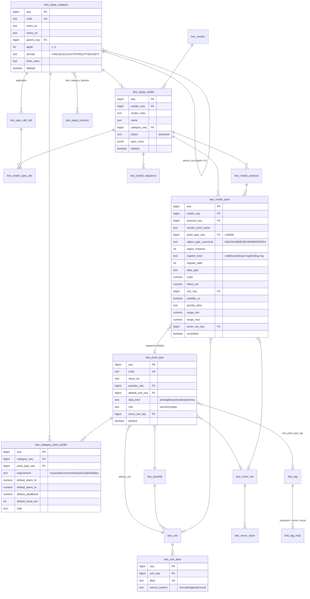
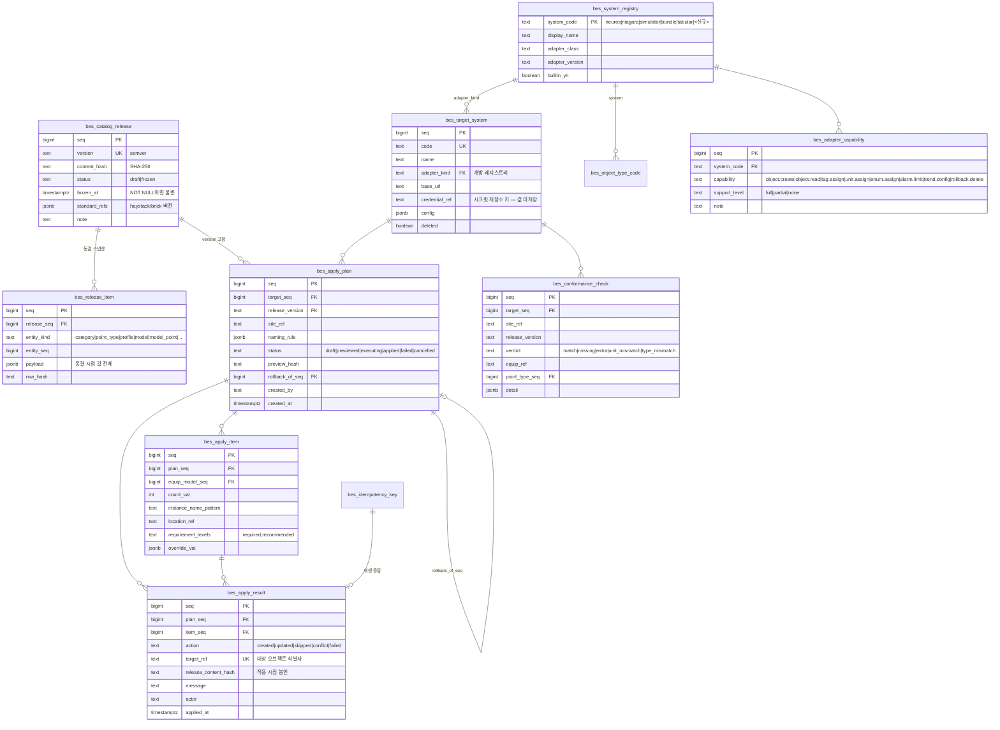
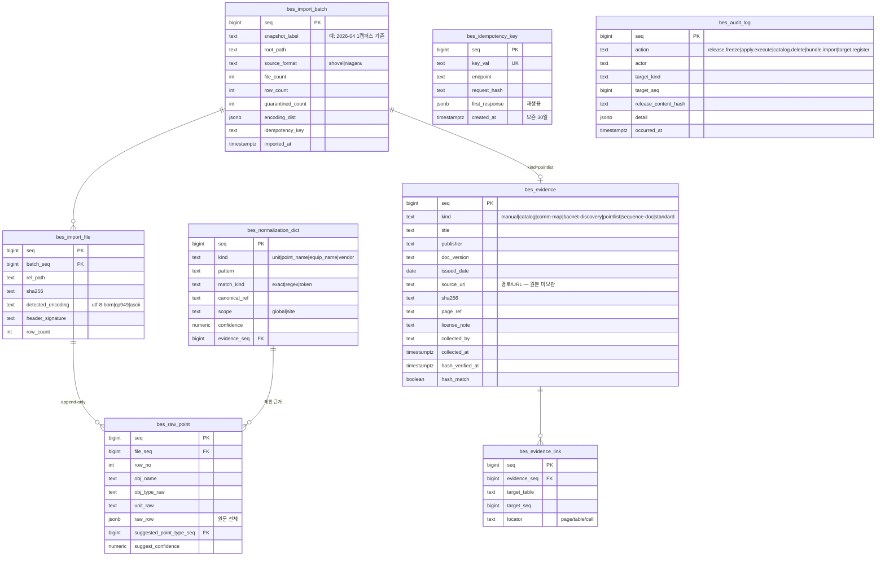

# API 계약 & 데이터 스키마 — BMS 장비 스펙 기준 DB

- 작성 2026-07-27 · service-autopilot A5 · 선행 `05-prd.md` · `06-architecture.md`
- 테이블 접두 `bes_` · 서비스 base path `/api/bes`

## 규약 (전 엔드포인트 공통)

- **에러 포맷**: RFC 9457 Problem JSON — `{type, title, status, detail, instance}` + 도메인 확장 필드.
  스택트레이스·SQL 노출 금지. `type`은 `https://bes.local/problems/<slug>` 형태.
- **버저닝**: 미디어타입 `Accept: application/vnd.bes.v1+json`. **URL 버저닝 회피**. 스펙 파일은 semver.
  (카탈로그 데이터의 버전인 `bes_catalog_release.version`과 **API 버전은 별개** — 혼동 금지)
- **페이지네이션**: 커서 기반 `?cursor=&limit=` (기본 50, 최대 500). `{items, nextCursor}`.
- **멱등성**: 부작용 있는 POST(`/execute`, `/imports`)는 `Idempotency-Key` 헤더 필수.
  클라이언트 생성 키, 서버 ≥30일 보관, 재시도 시 최초 응답 그대로 재생.
- **네이밍·권한**: 경로 kebab-case. 권한 스코프 `bes:<자원>:<행위>` (NEUROS `<모듈>:<자원>:<행위>` 규약과 동형).
- **정렬·필터**: `?sort=code,-updatedAt`, `?domain=HVAC&status=active`.
- **부분 실패**: 적용 실행은 200 + 항목별 결과 배열(전체 실패만 5xx). 부분 성공을 오류로 만들지 않는다.

## 엔드포인트 표

### 카탈로그 — 분류·포인트 타입·프로파일

| ID | 메서드 경로 | 요청(핵심) | 응답 | 주요 에러 | 스코프 |
|---|---|---|---|---|---|
| EP-01 | `GET /api/bes/equip-categories` | `?domain=HVAC&depth=3&tree=true` | 분류 트리 | — | `bes:catalog:read` |
| EP-02 | `POST /api/bes/equip-categories` | `code, nameKo, nameEn, parentSeq, domain, haystackEquipTags[], brickClass` | 201 분류 | `category-code-duplicate`(409), `category-cycle`(422 E-04), `category-depth-exceeded`(422) | `bes:catalog:write` |
| EP-03 | `PUT /api/bes/equip-categories/{seq}` | 위와 동일 | 200 | `frozen-release-reference`(400 E-01) | `bes:catalog:write` |
| EP-04 | `DELETE /api/bes/equip-categories/{seq}` | — | 204 (소프트삭제) | `category-has-children`(409), `frozen-release-reference`(400) | `bes:catalog:write` |
| EP-05 | `GET /api/bes/point-types` | `?quantity=&dataKind=&role=` | 목록 | — | `bes:catalog:read` |
| EP-06 | `POST /api/bes/point-types` | `code, nameKo, quantitySeq, defaultUnitSeq, dataKind, role, enumSetSeq?, tags[]` | 201 | `unit-quantity-mismatch`(422), `enum-required-for-multistate`(422) | `bes:catalog:write` |
| EP-07 | `PUT /api/bes/point-types/{seq}` | 위와 동일 | 200 | `frozen-release-reference`(400 E-01) | `bes:catalog:write` |
| EP-08 | `GET /api/bes/equip-categories/{seq}/point-profile` | — | 프로파일 행 목록 | — | `bes:catalog:read` |
| EP-09 | `PUT /api/bes/equip-categories/{seq}/point-profile` | `items[]{pointTypeSeq, requirement, defaultAlarmHi/Lo, defaultDeadband, defaultTrendSec, note}` | 200 | `forbidden-with-defaults`(422), `duplicate-point-type`(409) | `bes:catalog:write` |
| EP-10 | `GET /api/bes/units` | `?quantity=` | 단위 목록 | — | `bes:catalog:read` |
| EP-11 | `GET /api/bes/units/resolve` | `?text=%E2%84%83` | `{unitCode, canonical, matchedAlias}` | `unit-alias-unknown`(422 E-03) | `bes:catalog:read` |
| EP-12 | `POST /api/bes/unit-aliases` | `unitSeq, alias, sourceSystem` | 201 | `alias-duplicate`(409) | `bes:catalog:write` |
| EP-13 | `GET/POST /api/bes/enum-sets` | `code, name, values[]{ordinal, code, nameKo}` | 목록/201 | `enum-ordinal-duplicate`(409) | `bes:catalog:read`/`:write` |
| EP-14 | `GET /api/bes/tags` | `?source=haystack4&category=equip&q=` | 태그 목록 | — | `bes:catalog:read` |
| EP-15 | `POST /api/bes/tags/import` | `source, payload(파일 참조)` | 202 `{inserted, updated, skipped}` | `tag-source-unknown`(422) | `bes:catalog:write` |
| EP-16 | `GET/PUT /api/bes/spec-attr-defs` | `attrCode, name, quantitySeq, applicableCategorySeq, requiredYn` | 목록/200 | `attr-code-duplicate`(409) | `bes:catalog:read`/`:write` |
| EP-17 | `GET /api/bes/object-type-codes` | `?system=bacnet\|neuros\|niagara` | 코드 매핑표 | — | `bes:catalog:read` |
| EP-18 | `GET /api/bes/object-type-codes/translate` | `?from=niagara&to=neuros&code=Multi%20State%20Output` | `{canonical:"MSO", code:"7"}` — 정상 경로가 E-05 | `object-type-unmappable`(422, 미등록 코드) | `bes:catalog:read` |

### 모델 스펙

| ID | 메서드 경로 | 요청(핵심) | 응답 | 주요 에러 | 스코프 |
|---|---|---|---|---|---|
| EP-20 | `GET/POST /api/bes/vendors` | `code, name, country` | 목록/201 | `vendor-code-duplicate`(409) | `bes:catalog:read`/`bes:model:write` |
| EP-21 | `GET /api/bes/equip-models` | `?vendor=&categorySeq=&status=&q=` | 목록 | — | `bes:catalog:read` |
| EP-22 | `POST /api/bes/equip-models` | `vendorSeq, modelCode, name, categorySeq, status, specExtra?` | 201 | `model-duplicate`(409 E-07), `category-not-leaf`(422) | `bes:model:write` |
| EP-23 | `GET/PUT /api/bes/equip-models/{seq}/spec-attrs` | `items[]{attrCode, valueNum\|valueText, unitSeq, condition, evidenceSeq\|unverified}` | 200 | `evidence-required`(422 E-06), `unit-quantity-mismatch`(422), `required-attr-missing`(422) | `bes:model:write` |
| EP-24 | `GET/PUT /api/bes/equip-models/{seq}/protocols` | `items[]{protocol, role, defaultPort, baudRate, deviceInstance, note}` | 200 | `protocol-unknown`(422) | `bes:model:write` |
| EP-25 | `GET /api/bes/equip-models/{seq}/points` | `?unmappedOnly=true` | 모델 포인트 목록 | — | `bes:catalog:read` |
| EP-26 | `PUT /api/bes/equip-models/{seq}/points` | `items[]{vendorPointName, pointTypeSeq?, protocolSeq, objectTypeCanonical, objectInstance, registerKind, registerAddr, dataType, scale, offset, unitSeq, writableYn, priorityslots[], rangeMin/Max, enumSetSeq?, evidenceSeq\|unverified}` | 200 | `evidence-required`(422 E-06), `addr-required-for-modbus`(422 E-08), `object-instance-duplicate`(409) | `bes:model:write` |
| EP-27 | `POST /api/bes/equip-models/{seq}/points/bulk-map` | `mappings[]{modelPointSeq, pointTypeSeq}` | 200 `{mapped, remaining}` | `point-type-kind-mismatch`(422) | `bes:model:write` |
| EP-28 | `GET/PUT /api/bes/equip-models/{seq}/sequences` | `items[]{sequenceCode, standardRef, summary, params}` | 200 | `standard-body-not-allowed`(422 — 본문 길이·인용 감지) | `bes:model:write` |

### 근거(evidence)

| ID | 메서드 경로 | 요청(핵심) | 응답 | 주요 에러 | 스코프 |
|---|---|---|---|---|---|
| EP-30 | `GET /api/bes/evidence` | `?kind=&publisher=&q=` | 목록 (**`sourceUri`는 `bes:evidence:write` 보유자에게만 포함** — T-13) | — | `bes:catalog:read` |
| EP-31 | `POST /api/bes/evidence` | `kind, title, publisher, docVersion, issuedDate, sourceUri, sha256, pageRef, licenseNote` | 201 | `sha256-format`(422), `source-uri-outside-allowed-root`(422 T-13) | `bes:evidence:write` |
| EP-32 | `POST /api/bes/evidence/{seq}/verify-hash` | — | `{match:boolean, currentSha256, checkedAt}` | `source-unreachable`(503) | `bes:evidence:write` |
| EP-33 | `POST /api/bes/evidence/{seq}/links` | `targetTable, targetSeq, locator` | 201 | `target-not-found`(404) | `bes:evidence:write` |

### 릴리스

| ID | 메서드 경로 | 요청(핵심) | 응답 | 주요 에러 | 스코프 |
|---|---|---|---|---|---|
| EP-40 | `GET /api/bes/catalog-releases` | `?status=frozen` | 릴리스 목록 | — | `bes:catalog:read` |
| EP-41 | `POST /api/bes/catalog-releases` | `version, note, standardRefs{haystack, brick}` | 201 `{version, contentHash, frozenAt}` | `release-gate-failed`(409 E-02, `detail.missing[]`), `version-not-semver`(422), `version-duplicate`(409) | `bes:release:freeze` |
| EP-42 | `GET /api/bes/catalog-releases/{version}/export` | `?format=json\|haystack-zinc\|haystack-json\|brick-ttl\|bundle` | 파일 스트림 (bundle=서명 zip) | `format-unsupported`(422), `release-not-frozen`(409) | `bes:catalog:read` |
| EP-43 | `GET /api/bes/catalog-releases/diff` | `?from=v1.2.0&to=v1.3.0` | `{added[], changed[], removed[]}` | `release-not-found`(404) | `bes:catalog:read` |

### 적용

| ID | 메서드 경로 | 요청(핵심) | 응답 | 주요 에러 | 스코프 |
|---|---|---|---|---|---|
| EP-50 | `GET/POST /api/bes/target-systems` | `code, name, adapterKind(**개방 레지스트리** — 하드코딩 enum 아님), baseUrl?, credentialRef?, config` | 목록/201 | `target-code-duplicate`(409), `adapter-kind-unknown`(422), `credential-ref-invalid`(422) | `bes:catalog:read`/`bes:target:write` |
| EP-51 | `POST /api/bes/target-systems/{seq}/health` | — | `{reachable, adapterKind, capabilities[]}` | `target-unreachable`(503) | `bes:apply:preview` |
| EP-58 | `GET /api/bes/adapters` | — | 설치된 어댑터 목록 `[{kind, version, capabilities[], requiredConfig[]}]` — **신규 BMS 지원 여부를 여기서 확인** | — | `bes:catalog:read` |
| EP-59 | `GET /api/bes/apply-payload-schema` | `?releaseVersion=` | 시스템 중립 표준 페이로드 JSON Schema (FR-070) | — | `bes:catalog:read` |
| EP-52 | `POST /api/bes/apply-plans` | `targetSeq, releaseVersion, siteRef, namingRule, items[]{equipModelSeq, count, instanceNamePattern, locationRef, requirementLevels[], override}` | 201 plan(draft) | `release-not-frozen`(409 E-13), `model-not-in-release`(422) | `bes:apply:preview` |
| EP-53 | `POST /api/bes/apply-plans/{seq}/preview` | — | `{previewHash, summary{create,update,skip,conflict,unsupported}, objects[]{name, objectType, unit, tags[], defaults}, unsupportedCapabilities[], conflictDetectionAvailable}` — 어댑터에 `object.read`가 없으면 `conflictDetectionAvailable=false`로 **명시** | `target-unreachable`(503), `plan-empty`(422) | `bes:apply:preview` |
| EP-54 | `POST /api/bes/apply-plans/{seq}/execute` | 헤더 `Idempotency-Key` · 본문 `previewHash, enableAlarms=false` | 200 `{results[]{itemSeq, action, targetRef, message}}` — `action`에 **`unsupported`** 포함(FR-072: 미지원은 항목 단위 보고, 전체 실패 아님) | `preview-required`(409 E-11), `preview-hash-mismatch`(409), `batch-limit-exceeded`(413 E-12), `release-not-frozen`(409) | `bes:apply:execute` |
| EP-55 | `GET /api/bes/apply-plans/{seq}/results` | `?action=conflict` | 결과 목록 (불변) | — | `bes:catalog:read` |
| EP-56 | `POST /api/bes/apply-plans/{seq}/cancel` | — | 202 | `not-running`(409) | `bes:apply:execute` |
| EP-57 | `POST /api/bes/apply-plans/{seq}/rollback-plan` | — | 201 역계획(draft) `{deletes[], deactivates[]}` | `nothing-to-rollback`(409) | `bes:apply:execute` |

### 대조·취입 (P2)

| ID | 메서드 경로 | 요청(핵심) | 응답 | 주요 에러 | 스코프 |
|---|---|---|---|---|---|
| EP-60 | `POST /api/bes/conformance-checks` | `targetSeq, siteRef, releaseVersion` | 202 `{checkSeq}` | `target-unreachable`(503) | `bes:apply:preview` |
| EP-61 | `GET /api/bes/conformance-checks/{seq}` | `?verdict=missing` | `{summary, items[]{equipRef, pointTypeSeq, verdict, detail}}` | — | `bes:catalog:read` |
| EP-62 | `POST /api/bes/imports` | 헤더 `Idempotency-Key` · multipart 또는 `{rootPath, snapshotLabel}` | 202 `{batchSeq}` | `header-signature-unknown`(422), `file-too-large`(413) | `bes:import:write` |
| EP-63 | `GET /api/bes/imports/{seq}` | — | `{files, rows, encodingDist, quarantinedRows}` | — | `bes:catalog:read` |
| EP-64 | `GET /api/bes/imports/{seq}/coverage` | `?scoreSet=default` | `{explainedPct, unexplained[]}` | `score-set-not-found`(404) | `bes:catalog:read` |
| EP-65 | `GET/POST /api/bes/normalization-dict` | `kind, pattern, matchKind, canonicalRef, scope, confidence` | 목록/201 | `pattern-invalid-regex`(422) | `bes:catalog:read`/`bes:import:write` |
| EP-66 | `POST /api/bes/imports/{seq}/suggest` | `?kind=point_name` | `{suggestions[]{raw, candidatePointTypeSeq, confidence, ruleSeq}}` | — | `bes:import:write` |

### 감사

| ID | 메서드 경로 | 요청(핵심) | 응답 | 주요 에러 | 스코프 |
|---|---|---|---|---|---|
| EP-70 | `GET /api/bes/audit-logs` | `?action=&actor=&from=&to=` | 불변 감사 목록 | — | `bes:audit:read` |

## OpenAPI 스케치 (핵심 3 리소스만 — 전문은 구현 단계)

```yaml
openapi: 3.0.3
info: { title: BMS Equip Spec Registry API, version: 1.0.0 }
paths:
  /api/bes/units/resolve:
    get:
      operationId: resolveUnit
      parameters:
        - { name: text, in: query, required: true, schema: { type: string }, example: "℃" }
      responses:
        "200":
          content:
            application/vnd.bes.v1+json:
              schema:
                type: object
                required: [unitCode, canonical]
                properties:
                  unitCode:  { type: string, example: degC }
                  canonical: { type: string, example: degC }
                  matchedAlias: { type: string, example: "℃" }
        "422": { $ref: "#/components/responses/Problem" }
  /api/bes/catalog-releases:
    post:
      operationId: freezeRelease
      security: [ { bearerAuth: [ "bes:release:freeze" ] } ]
      requestBody:
        required: true
        content:
          application/vnd.bes.v1+json:
            schema:
              type: object
              required: [version]
              properties:
                version: { type: string, pattern: '^\d+\.\d+\.\d+$' }
                note:    { type: string }
                standardRefs:
                  type: object
                  properties:
                    haystack: { type: string, example: "4.0" }
                    brick:    { type: string, example: "1.1" }
      responses:
        "201":
          content:
            application/vnd.bes.v1+json:
              schema:
                type: object
                properties:
                  version:     { type: string }
                  contentHash: { type: string, description: SHA-256 of canonical JSON }
                  frozenAt:    { type: string, format: date-time }
        "409":
          description: 동결 게이트 실패 (결손 분류)
          content:
            application/problem+json:
              schema:
                allOf:
                  - $ref: "#/components/schemas/Problem"
                  - type: object
                    properties:
                      missing:
                        type: array
                        items:
                          type: object
                          properties:
                            categoryCode: { type: string }
                            reason:
                              type: string
                              enum: [no-haystack-tag, no-spec-attr-def, no-required-point-type]
  /api/bes/apply-plans/{seq}/execute:
    post:
      operationId: executeApplyPlan
      security: [ { bearerAuth: [ "bes:apply:execute" ] } ]
      parameters:
        - { name: seq, in: path, required: true, schema: { type: integer, format: int64 } }
        - name: Idempotency-Key
          in: header
          required: true
          schema: { type: string, maxLength: 128 }
      requestBody:
        required: true
        content:
          application/vnd.bes.v1+json:
            schema:
              type: object
              required: [previewHash]
              properties:
                previewHash:  { type: string }
                enableAlarms: { type: boolean, default: false }
      responses:
        "200":
          content:
            application/vnd.bes.v1+json:
              schema:
                type: object
                properties:
                  results:
                    type: array
                    items:
                      type: object
                      properties:
                        itemSeq:   { type: integer, format: int64 }
                        action:    { type: string, enum: [created, updated, skipped, conflict, failed] }
                        targetRef: { type: string }
                        message:   { type: string }
        "409": { $ref: "#/components/responses/Problem" }
        "413": { $ref: "#/components/responses/Problem" }
components:
  securitySchemes:
    bearerAuth: { type: http, scheme: bearer, bearerFormat: JWT }
  schemas:
    Problem:
      type: object
      required: [type, title, status]
      properties:
        type:     { type: string, format: uri }
        title:    { type: string }
        status:   { type: integer }
        detail:   { type: string }
        instance: { type: string }
  responses:
    Problem:
      description: RFC 9457 Problem Details
      content:
        application/problem+json:
          schema: { $ref: "#/components/schemas/Problem" }
```

## 시스템 중립 표준 적용 페이로드 (FR-070 · SC-015)

코어가 만들어내는 **유일한 출력**이다. 어댑터만 이걸 각 BMS 용어로 번역한다.
**여기에 특정 BMS 컬럼명·코드가 들어가면 설계 실패**다 (`OBJ_TYPE`·`SYSTEM_PT_ID`·`Inst Num` 등 금지).

```json
{
  "$schema": "https://bes.local/schemas/apply-payload/1.0.json",
  "releaseVersion": "1.3.0",
  "releaseContentHash": "9f2c…",
  "site": { "ref": "SEOUL-CAMPUS-1", "buildingRef": "A", "spaceRef": "3F" },
  "equips": [
    {
      "localId": "eq-1",
      "name": "AHU-3F-01",
      "categoryCode": "HVAC.AIR.AHU",
      "modelRef": { "vendorCode": "TRANE", "modelCode": "UC-800" },
      "tags": ["ahu", "equip"],
      "functions": ["cools", "heats", "ventilates"],
      "specs": [
        { "attrCode": "airflow.rated", "value": 12000, "unit": "m3h", "condition": "정격" },
        { "attrCode": "staticPressure.rated", "value": 60, "unit": "mmH2O" }
      ]
    }
  ],
  "points": [
    {
      "localId": "pt-1",
      "equipLocalId": "eq-1",
      "name": "AHU-3F-01.급기온도",
      "pointTypeCode": "AIR.TEMP.DISCHARGE",
      "dataKind": "analog",
      "role": "sensor",
      "objectTypeCanonical": "AI",
      "unit": "degC",
      "tags": ["discharge", "air", "temp", "sensor", "point"],
      "writable": false,
      "range": { "min": -20, "max": 60 },
      "defaults": { "alarmHi": 40, "alarmLo": 5, "deadband": 0.5, "trendSec": 300, "alarmEnabled": false },
      "addressing": {
        "protocol": "bacnet-ip",
        "objectInstance": 10301,
        "registerKind": null,
        "registerAddr": null,
        "scale": 1,
        "offset": 0
      }
    }
  ],
  "enumSets": [
    { "code": "RUN.STOP", "values": [ { "ordinal": 0, "code": "STOP" }, { "ordinal": 1, "code": "RUN" } ] }
  ],
  "namingRule": { "pattern": "{equipName}.{pointTypeName}", "case": "asis" }
}
```

번역 예 — 같은 `objectTypeCanonical: "AI"`가 어댑터별로:
NEUROS `OBJ_TYPE=0` · Niagara `Analog Input` · BACnet enum `0` · 표 내보내기 `TYPE="AI"`.
`MSO`는 NEUROS `7` / BACnet `14`로 **서로 다르게** 번역된다 — 이게 어댑터가 존재하는 이유다.

## ERD

### ① 표준 카탈로그 + 모델 스펙



### ② 릴리스 · 적용



### ③ 근거 · 취입



`bes_idempotency_key`·`bes_audit_log`는 다른 엔티티와 FK로 묶지 않는다 — 어떤 엔드포인트에서도 기록되고,
대상이 삭제돼도 기록은 남아야 하기 때문이다(불변 감사, T-04·FR-061).

## DDL 스케치 (PostgreSQL — 제약이 설계인 부분만)

```sql
-- 분류 트리: 깊이 3 상한 + 순환 차단(트리거) + 코드 유일
CREATE TABLE bes_equip_category (
  seq         bigserial PRIMARY KEY,
  code        text NOT NULL,
  name_ko     text NOT NULL,
  name_en     text,
  parent_seq  bigint REFERENCES bes_equip_category(seq),
  depth       smallint NOT NULL CHECK (depth BETWEEN 1 AND 3),
  domain      text NOT NULL CHECK (domain IN ('HVAC','ELEC','LIGHT','FIRE','LIFT','ENV','ETC')),
  brick_class text,
  deleted     boolean NOT NULL DEFAULT false,
  CONSTRAINT uq_category_code UNIQUE (code),
  CONSTRAINT ck_root_has_no_parent CHECK ((depth = 1) = (parent_seq IS NULL))
);

-- 단위 별칭: 실측 표기 변형을 canonical 1건으로 수렴 (SC-006)
CREATE TABLE bes_unit_alias (
  seq           bigserial PRIMARY KEY,
  unit_seq      bigint NOT NULL REFERENCES bes_unit(seq),
  alias         text   NOT NULL,
  source_system text   NOT NULL CHECK (source_system IN ('shovel','niagara','manual')),
  CONSTRAINT uq_alias UNIQUE (alias)          -- 한 표기가 두 단위를 가리키는 것을 원천 차단
);
-- 시드 예: ('℃'→degC),('°C'→degC),('CMH'→m3h),('m³/hr'→m3h),('㎥/h'→m3h),('mmAq'→mmH2O)

-- 프로파일: 분류×포인트타입 유일 + forbidden에 기본값 금지
CREATE TABLE bes_category_point_profile (
  seq               bigserial PRIMARY KEY,
  category_seq      bigint NOT NULL REFERENCES bes_equip_category(seq),
  point_type_seq    bigint NOT NULL REFERENCES bes_point_type(seq),
  requirement       text   NOT NULL CHECK (requirement IN ('required','recommended','optional','forbidden')),
  default_alarm_hi  numeric,
  default_alarm_lo  numeric,
  default_deadband  numeric,
  default_trend_sec integer CHECK (default_trend_sec IS NULL OR default_trend_sec > 0),
  note              text,
  CONSTRAINT uq_profile UNIQUE (category_seq, point_type_seq),
  CONSTRAINT ck_forbidden_no_defaults CHECK (
    requirement <> 'forbidden'
    OR (default_alarm_hi IS NULL AND default_alarm_lo IS NULL
        AND default_deadband IS NULL AND default_trend_sec IS NULL)),
  CONSTRAINT ck_alarm_range CHECK (default_alarm_hi IS NULL OR default_alarm_lo IS NULL
                                   OR default_alarm_hi > default_alarm_lo)
);

-- 모델 포인트: 근거 강제 (SC-007) + 프로토콜별 주소 필수 규칙
CREATE TABLE bes_model_point (
  seq                   bigserial PRIMARY KEY,
  model_seq             bigint NOT NULL REFERENCES bes_equip_model(seq),
  protocol_seq          bigint NOT NULL REFERENCES bes_model_protocol(seq),
  vendor_point_name     text   NOT NULL,
  point_type_seq        bigint REFERENCES bes_point_type(seq),      -- 미연결 허용(FR-015)
  object_type_canonical text CHECK (object_type_canonical IN
                            ('AI','AO','AV','BI','BO','BV','MSI','MSO','MSV','LAV','NC','SV')),
  object_instance       integer,
  register_kind         text CHECK (register_kind IN ('coil','discrete','input-reg','holding-reg')),
  register_addr         integer,
  data_type             text,
  scale                 numeric NOT NULL DEFAULT 1,
  offset_val            numeric NOT NULL DEFAULT 0,
  unit_seq              bigint REFERENCES bes_unit(seq),
  writable_yn           boolean NOT NULL DEFAULT false,
  priority_slots        text,                                       -- 예: 'in1,in4,in7,in8'
  range_min             numeric,
  range_max             numeric,
  enum_set_seq          bigint REFERENCES bes_enum_set(seq),
  unverified            boolean NOT NULL DEFAULT false,
  CONSTRAINT ck_range CHECK (range_min IS NULL OR range_max IS NULL OR range_min < range_max),
  CONSTRAINT uq_model_object UNIQUE (model_seq, protocol_seq, object_type_canonical, object_instance)
);
-- 근거-또는-unverified 강제: 링크는 별도 테이블이므로 트리거로 검증 (E-06 / SC-007)
CREATE OR REPLACE FUNCTION bes_require_evidence() RETURNS trigger AS $$
BEGIN
  IF NEW.unverified THEN RETURN NEW; END IF;
  IF NOT EXISTS (SELECT 1 FROM bes_evidence_link
                  WHERE target_table = TG_TABLE_NAME AND target_seq = NEW.seq) THEN
    RAISE EXCEPTION 'evidence-required: % seq=%', TG_TABLE_NAME, NEW.seq;
  END IF;
  RETURN NEW;
END $$ LANGUAGE plpgsql;
-- 링크가 나중에 붙으므로 CONSTRAINT TRIGGER DEFERRABLE INITIALLY DEFERRED 로 커밋 시점 검사
CREATE CONSTRAINT TRIGGER trg_model_point_evidence
  AFTER INSERT OR UPDATE ON bes_model_point
  DEFERRABLE INITIALLY DEFERRED
  FOR EACH ROW EXECUTE FUNCTION bes_require_evidence();

-- 릴리스 동결 불변 (SC-011)
CREATE OR REPLACE FUNCTION bes_block_frozen() RETURNS trigger AS $$
BEGIN
  IF OLD.frozen_at IS NOT NULL THEN
    RAISE EXCEPTION 'frozen-release-immutable: version=%', OLD.version;
  END IF;
  RETURN NEW;
END $$ LANGUAGE plpgsql;
CREATE TRIGGER trg_release_immutable BEFORE UPDATE OR DELETE ON bes_catalog_release
  FOR EACH ROW EXECUTE FUNCTION bes_block_frozen();

-- 적용 결과: 대상 오브젝트당 1행 (멱등의 근거, SC-005)
CREATE TABLE bes_apply_result (
  seq                  bigserial PRIMARY KEY,
  plan_seq             bigint NOT NULL REFERENCES bes_apply_plan(seq),
  item_seq             bigint NOT NULL REFERENCES bes_apply_item(seq),
  action               text   NOT NULL CHECK (action IN ('created','updated','skipped','conflict','failed')),
  target_ref           text   NOT NULL,
  release_content_hash text   NOT NULL,
  message              text,
  actor                text   NOT NULL,
  applied_at           timestamptz NOT NULL DEFAULT now(),
  CONSTRAINT uq_result_target UNIQUE (plan_seq, target_ref)
);
REVOKE UPDATE, DELETE ON bes_apply_result FROM bes_app;   -- 불변 감사 (T-04)

-- 시스템 개방 레지스트리 (FR-073): 신규 BMS 추가 시 스키마 변경 없이 행 1개만 넣는다
CREATE TABLE bes_system_registry (
  system_code     text PRIMARY KEY,          -- 하드코딩 CHECK 금지 — 확장성의 핵심
  display_name    text NOT NULL,
  adapter_class   text,                      -- 어댑터 구현 참조 (없으면 코드 매핑 전용 시스템)
  adapter_version text,
  builtin_yn      boolean NOT NULL DEFAULT false
);
INSERT INTO bes_system_registry(system_code, display_name, builtin_yn) VALUES
  ('bacnet','BACnet 표준',true), ('neuros','NEUROS(SiWeb)',true),
  ('niagara','Tridium Niagara',true), ('simulator','자동제어 시뮬레이터',true),
  ('bundle','오프라인 번들',true), ('tabular','표 내보내기(레거시)',true);

-- 오브젝트 타입 코드 매핑 (SC-008): canonical ↔ 체계별 코드, 왕복 유일
CREATE TABLE bes_object_type_code (
  seq       bigserial PRIMARY KEY,
  system    text NOT NULL REFERENCES bes_system_registry(system_code),
  code      text NOT NULL,
  canonical text NOT NULL,
  CONSTRAINT uq_system_code      UNIQUE (system, code),
  CONSTRAINT uq_system_canonical UNIQUE (system, canonical)   -- 양방향 무손실 보장
);
-- 시드(실측·표준 근거): bacnet AI=0,AO=1,AV=2,BI=3,BO=4,BV=5,MSI=13,MSO=14,MSV=19
--                      neuros AI=0,AO=1,AV=2,BI=3,BO=4,BV=5,MSI=6, MSO=7, MSV=8, ETC=9
--                      niagara 'Analog Input'…'Multi State Output','Notification Class','Structured View'

-- 어댑터 능력 선언 (FR-072): 미지원을 실패가 아니라 데이터로 다룬다
CREATE TABLE bes_adapter_capability (
  seq           bigserial PRIMARY KEY,
  system_code   text NOT NULL REFERENCES bes_system_registry(system_code),
  capability    text NOT NULL,
  support_level text NOT NULL CHECK (support_level IN ('full','partial','none')),
  note          text,
  CONSTRAINT uq_capability UNIQUE (system_code, capability)
);
```

## 데이터 규칙

| 항목 | 규칙 |
|---|---|
| 식별자 | 내부 PK `seq bigserial`, 외부 노출·참조는 사람이 읽는 `code`(유일). NEUROS 컨벤션과 동형 |
| 시각 | `timestamptz`, 저장·전송 모두 **UTC ISO 8601**. 표시 시점만 KST 변환 |
| 수치 | 스펙 값·한계·scale/offset은 `numeric`(부동소수 금지 — 실측 O-06에서 `"2.0"` 오염 확인). 정수 필드는 파싱 시 정수 강제, 위반 행은 격리 |
| 단위 | 자유 문자열 금지. `bes_unit` FK + `bes_unit_alias` 경유만 |
| 소프트삭제 | 카탈로그 마스터(`deleted boolean`). **불변 테이블은 예외**: `bes_release_item`·`bes_apply_result`·`bes_raw_point`·`bes_audit_log`는 삭제 개념 없음 |
| 해시 | 근거·릴리스·번들 모두 **SHA-256 hex 소문자 64자** (`CHECK (sha256 ~ '^[0-9a-f]{64}$')`) |
| 보존 | 카탈로그·릴리스·적용 결과·감사는 **무기한**(설계 근거 자료). `bes_raw_point`는 배치 단위로 폐기 가능(기본 보존 3년) |
| 인코딩 | 취입 시 BOM 감지 → UTF-8, 아니면 CP949 폴백. 판별 결과를 `bes_import_file.detected_encoding`에 기록(실측 O-01) |
| 명명 | 테이블·컬럼 snake_case, API 필드 camelCase, 코드값 UPPER 또는 kebab (표준 태그는 원 표기 유지 — Haystack은 `elec-meter` 형태) |

## 커버리지 매핑 (FR → 엔드포인트)

| FR | 우선 | 담당 엔드포인트 |
|---|---|---|
| FR-001 | P0 | EP-01, EP-02, EP-03, EP-04 |
| FR-002 | P0 | EP-05, EP-06, EP-07 |
| FR-003 | P0 | EP-08, EP-09 |
| FR-004 | P0 | EP-10, EP-11, EP-12 |
| FR-005 | P1 | EP-13 (+ EP-06 `enumSetSeq`) |
| FR-006 | P1 | EP-14, EP-15 |
| FR-007 | P1 | EP-16 |
| FR-010 | P0 | EP-20, EP-21, EP-22 |
| FR-011 | P0 | EP-23 |
| FR-012 | P0 | EP-24 |
| FR-013 | P0 | EP-25, EP-26 |
| FR-014 | P0 | EP-17, EP-18 |
| FR-015 | P1 | EP-25(`?unmappedOnly`), EP-27 |
| FR-016 | P2 | EP-28 |
| FR-020 | P0 | EP-30, EP-31 |
| FR-021 | P0 | EP-23, EP-26 (검증), EP-33 (링크) |
| FR-022 | P1 | EP-32 |
| FR-030 | P0 | EP-41 |
| FR-031 | P0 | EP-42 |
| FR-032 | P1 | EP-43 |
| FR-040 | P0 | EP-50, EP-51 |
| FR-041 | P0 | EP-52 |
| FR-042 | P0 | EP-53 |
| FR-043 | P0 | EP-54, EP-55 |
| FR-044 | P0 | EP-54 (Idempotency-Key + `uq_result_target`) |
| FR-045 | P1 | EP-57 |
| FR-046 | P1 | EP-54 (`enableAlarms=false` 기본) |
| FR-047 | P1 | EP-54 (413 상한), EP-56 |
| FR-051 | **P1** | EP-62, EP-63 |
| FR-052 | **P1** | EP-64 |
| FR-053 | P2 | EP-65, EP-66 |
| FR-050 | P2 | EP-60, EP-61 |
| FR-060 | P0 | 전 엔드포인트 스코프 열 (서버측 강제) |
| FR-061 | P0 | EP-70 + `bes_apply_result`·`bes_audit_log` 불변 |
| FR-070 | P0 | EP-59 (스키마 공개), EP-53·EP-54 (페이로드 생산) |
| FR-071 | P0 | EP-58 (어댑터 목록) + `bes_system_registry.adapter_class` |
| FR-072 | P0 | EP-51·EP-58 (능력 선언), EP-53 `unsupportedCapabilities[]`, EP-54 `action=unsupported` |
| FR-073 | P1 | EP-17, EP-18 + `bes_system_registry` (CHECK 대신 FK) |
| FR-074 | P1 | EP-58 `kind` (rest·file·bundle·tabular), EP-42 `format` |

**P0/P1 요구사항 매핑 0건 = 없음** (P0 23건·P1 13건 전수 매핑 완료. P2 3건도 매핑됨).

## 성공기준 → 검증 지점

| SC | 어디서 판정하나 |
|---|---|
| SC-001 · SC-002 | EP-41 동결 게이트 (409 `missing[]`) |
| SC-003 | EP-64 커버리지 (`explainedPct ≥ 80`) |
| SC-004 | EP-53 preview 결과 ↔ EP-55 실제 결과 대사 |
| SC-005 | EP-54 2회 실행 후 `uq_result_target` 유지·대상 수 불변 |
| SC-006 | EP-11 `units/resolve` 전 실측 표기 입력 |
| SC-007 | `trg_model_point_evidence` + EP-23/EP-26 422 |
| SC-008 | EP-18 왕복 변환 (`uq_system_canonical`가 구조적으로 보장) |
| SC-009 · SC-010 | 시드 데이터 성능 테스트 (A6) |
| SC-011 | `trg_release_immutable` + 검증 쿼리 |
| SC-012 | EP-63 `encodingDist`·치환문자 검사 |
| SC-013 | 신규 어댑터 추가 PR의 diff 경로 검사 (어댑터 패키지 밖 변경 0줄) |
| SC-014 | 능력 `none`인 어댑터로 적용 → EP-54 결과에 `unsupported` 항목 + 나머지 `created` |
| SC-015 | EP-59 스키마에 금지 용어 사전(`OBJ_TYPE`·`SYSTEM_PT_ID`·`Inst Num`·`Export Ord` …) 검사 |
